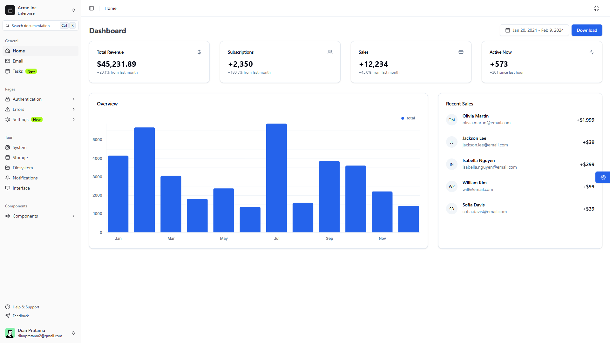
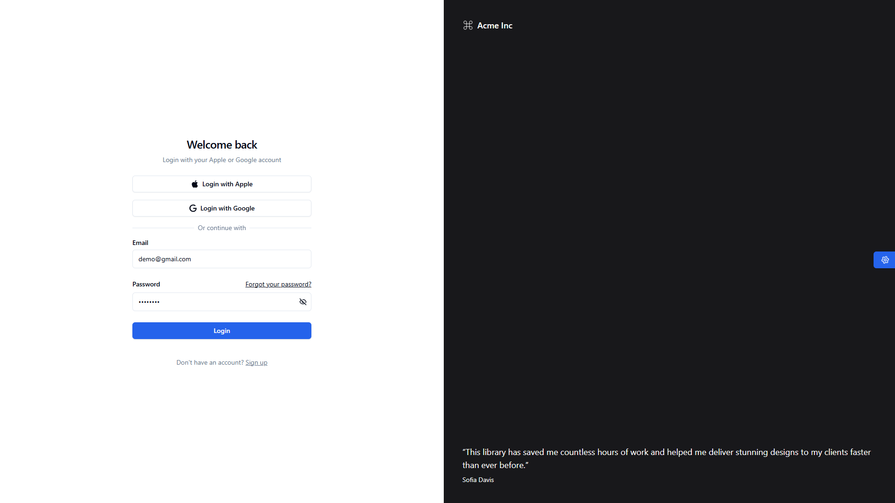
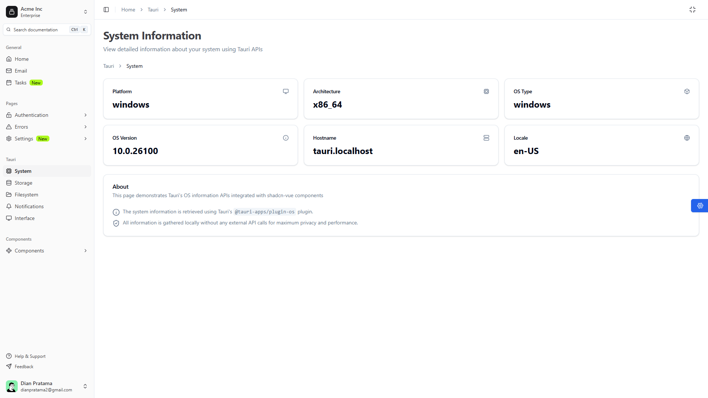
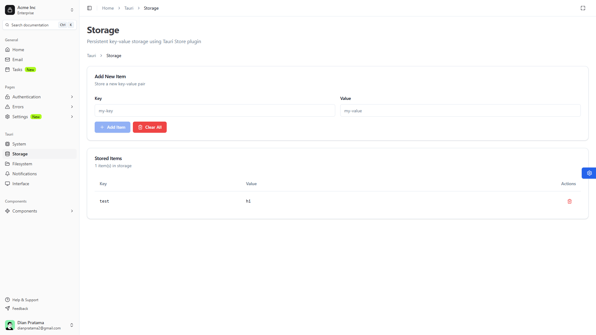
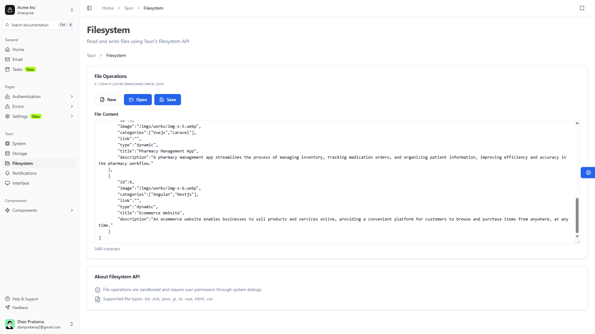
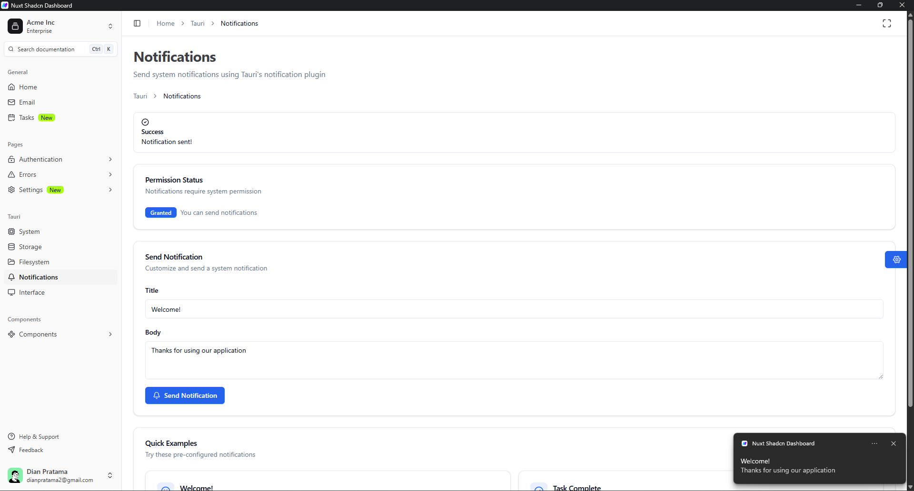
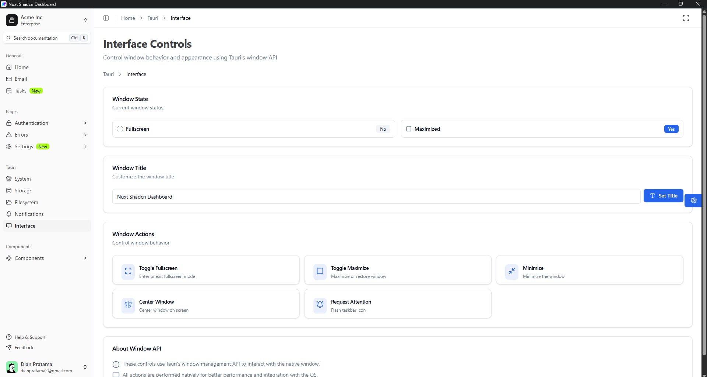
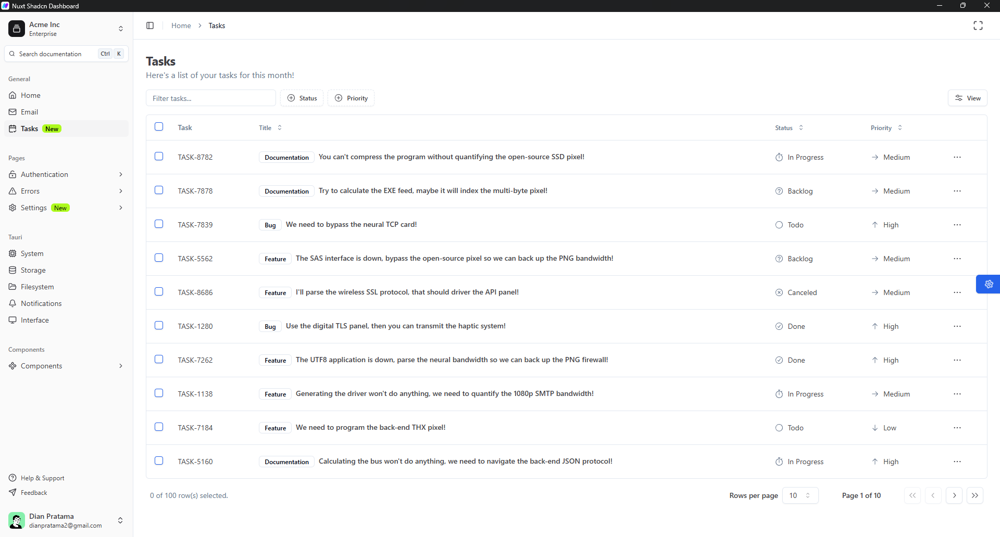

# 🚀 Nuxt Shadcn Dashboard + Tauri Desktop App

[![Built with Nuxt][nuxt-src]][nuxt-href]
[![Built with Tauri][tauri-src]][tauri-href]
[![Powered by shadcn-vue][shadcn-src]][shadcn-href]

> **🎉 Now powered by Nuxt 4!** Upgraded to the latest Nuxt 4.1.2 for improved performance and developer experience.

A modern, cross-platform desktop dashboard application built with **Nuxt 4**, **Tauri 2**, **shadcn-vue**, and **UnoCSS**. This project combines the power of web technologies with native desktop capabilities.

## ✨ Features

### 🎨 Modern UI Components
- Built with **shadcn-vue** - Beautiful, accessible component library
- **UnoCSS** for instant, on-demand atomic CSS
- **Dark mode** support with theme customization
- Responsive design optimized for desktop

### 🖥️ Desktop Integration with Tauri
- **System Information** - Display OS platform, architecture, version, and hostname
- **Persistent Storage** - Key-value store with CRUD operations
- **File System** - Read and write text files with native dialogs
- **Notifications** - Send system notifications
- **Window Management** - Fullscreen toggle, maximize, minimize, and center controls
- **Cross-platform** - Build for Windows, macOS, and Linux

### 📊 Dashboard Pages
- Overview dashboard with charts and statistics
- Email client interface
- Task management system
- Settings with account, appearance, and notifications
- Complete authentication flow (login, register, forgot password)

## 🛠️ Tech Stack

- **[Nuxt 4](https://nuxt.com/)** - The Intuitive Vue Framework
- **[Tauri 2](https://v2.tauri.app/)** - Build smaller, faster, and more secure desktop applications
- **[shadcn-vue](https://www.shadcn-vue.com/)** - Re-usable components built with Radix Vue and Tailwind CSS
- **[UnoCSS](https://unocss.dev/)** - Instant On-demand Atomic CSS Engine
- **[TypeScript](https://www.typescriptlang.org/)** - Type safety and better DX
- **[Rust](https://www.rust-lang.org/)** - Tauri backend for native capabilities

## 📦 Installation

### Prerequisites
- **Node.js** (v18 or higher)
- **pnpm** (recommended) or npm
- **Rust** (for Tauri) - [Install Rust](https://www.rust-lang.org/tools/install)

### Setup

```bash
# Clone the repository
git clone https://github.com/othmane-ba/nuxt-shadcn-tauri-dashboard.git
cd nuxt-shadcn-tauri-dashboard

# Install dependencies
pnpm install

# Start development server (web mode)
pnpm dev

# Start Tauri development (desktop app)
pnpm tauri:dev
```

## 🚀 Usage

### Development

```bash
# Web development (browser)
pnpm dev

# Desktop development (Tauri)
pnpm tauri:dev

# Build for production (web)
pnpm build
pnpm generate

# Build desktop app (Windows/macOS/Linux)
pnpm tauri:build
```

### Generate App Icons

```bash
# Generate app icons from a source image (1024x1024 PNG recommended)
pnpm tauri:icon path/to/your/icon.png
```

## 📁 Project Structure

```
.
├── components/          # Vue components
│   ├── auth/           # Authentication components
│   ├── dashboard/      # Dashboard widgets
│   ├── layout/         # Layout components (Header, Sidebar)
│   ├── settings/       # Settings forms
│   ├── tasks/          # Task management
│   └── ui/             # shadcn-vue UI components
├── pages/              # Nuxt pages (auto-routing)
│   ├── tauri/          # Tauri feature pages
│   │   ├── system.vue      # OS information
│   │   ├── storage.vue     # Key-value storage
│   │   ├── filesystem.vue  # File operations
│   │   ├── notifications.vue
│   │   └── interface.vue   # Window management
│   ├── (auth)/         # Auth pages
│   └── settings/       # Settings pages
├── src-tauri/          # Tauri Rust backend
│   ├── src/
│   │   ├── main.rs     # Tauri app entry point
│   │   └── lib.rs      # Custom commands
│   ├── Cargo.toml      # Rust dependencies
│   ├── tauri.conf.json # Tauri configuration
│   └── capabilities/   # Permission definitions
├── composables/        # Vue composables
├── constants/          # App constants (menus, etc.)
└── lib/                # Utility functions
```

## 🎯 Key Features Explained

### Tauri Pages

#### System Information (`/tauri/system`)
Displays comprehensive system information using `@tauri-apps/plugin-os`:
- Platform (Windows, macOS, Linux)
- Architecture (x64, ARM, etc.)
- OS Type and Version
- Hostname

#### Storage (`/tauri/storage`)
Persistent key-value storage with `@tauri-apps/plugin-store`:
- Add, view, and delete items
- JSON-based storage
- Automatic persistence

#### File System (`/tauri/filesystem`)
File operations with native dialogs using `@tauri-apps/plugin-fs`:
- Open and read text files (.txt, .md, .json, .js, .ts, .vue)
- Save and write files
- Native file picker dialogs

#### Notifications (`/tauri/notifications`)
System notification integration:
- Permission request flow
- Pre-configured notification templates
- Native OS notifications

#### Interface (`/tauri/interface`)
Window management controls:
- Toggle fullscreen
- Maximize/minimize windows
- Center window on screen
- Window state tracking

### Window Controls
The header component includes a fullscreen toggle button (only visible in Tauri desktop mode) that allows quick fullscreen switching.

## ⚙️ Configuration

### Tauri Configuration
Edit `src-tauri/tauri.conf.json` to customize:
- App name and version
- Window size and properties
- Build settings
- Bundle configuration

### Permissions
Tauri uses a security model with explicit permissions. Edit `src-tauri/capabilities/default.json` to modify API access.

## 🎨 Customization

### Theme
Customize colors and appearance in:
- `app.config.ts` - App-level settings
- `uno.config.ts` - UnoCSS theme configuration
- Components use CSS variables for theming

### Menus
Edit `constants/menus.ts` to modify sidebar navigation.

## 🤝 Contributing

Contributions are welcome! Please feel free to submit a Pull Request.

1. Fork the repository
2. Create your feature branch (`git checkout -b feature/AmazingFeature`)
3. Commit your changes (`git commit -m 'Add some AmazingFeature'`)
4. Push to the branch (`git push origin feature/AmazingFeature`)
5. Open a Pull Request

## 📝 License

MIT License - feel free to use this project for personal or commercial purposes.

## 👤 Author

**Othmane Bakkes**
- GitHub: [@othmane-ba](https://github.com/othmane-ba)

## 🙏 Credits

- Original dashboard template by [dianprata](https://github.com/dianprata/nuxt-shadcn-dashboard)
- [Nuxt.js](https://nuxtjs.org/) - Vue.js framework
- [Tauri](https://tauri.app/) - Desktop app framework
- [shadcn-vue](https://www.shadcn-vue.com/) - UI components
- [UnoCSS](https://unocss.com/) - CSS engine
- [Radix Vue](https://www.radix-vue.com/) - Headless UI components

## 📸 Screenshots

### Dashboard Overview


### Login Overview


### Tauri System Information


### Storage Management


### Filesystem


### Notifications


### Interface Controls


### Settings & Configuration


### Additional Pages
The application also includes:
- **Tasks Management** - Complete task tracking system with status management
- **Email Client** - Modern email interface with sidebar navigation
- **Component Gallery** - Showcase of all available shadcn-vue components
- **Authentication Pages** - Login, register, and password reset flows
- **Error Pages** - Custom 404, 401, 403, 500, and 503 error pages

## 🗺️ Roadmap

- [ ] Add more Tauri integrations (clipboard, global shortcuts)
- [ ] Implement auto-updates
- [ ] Add system tray functionality
- [ ] Database integration (SQLite)
- [ ] Multi-window support

---

Built with ❤️ by [Othmane Bakkes](https://github.com/othmane-ba)

[nuxt-src]: https://img.shields.io/badge/Built%20With%20Nuxt-18181B?logo=nuxt.js
[nuxt-href]: https://nuxt.com/
[tauri-src]: https://img.shields.io/badge/Built%20With%20Tauri-FFC131?logo=tauri&logoColor=black
[tauri-href]: https://tauri.app/
[shadcn-src]: https://img.shields.io/badge/UI-shadcn/vue-black
[shadcn-href]: https://www.shadcn-vue.com/
